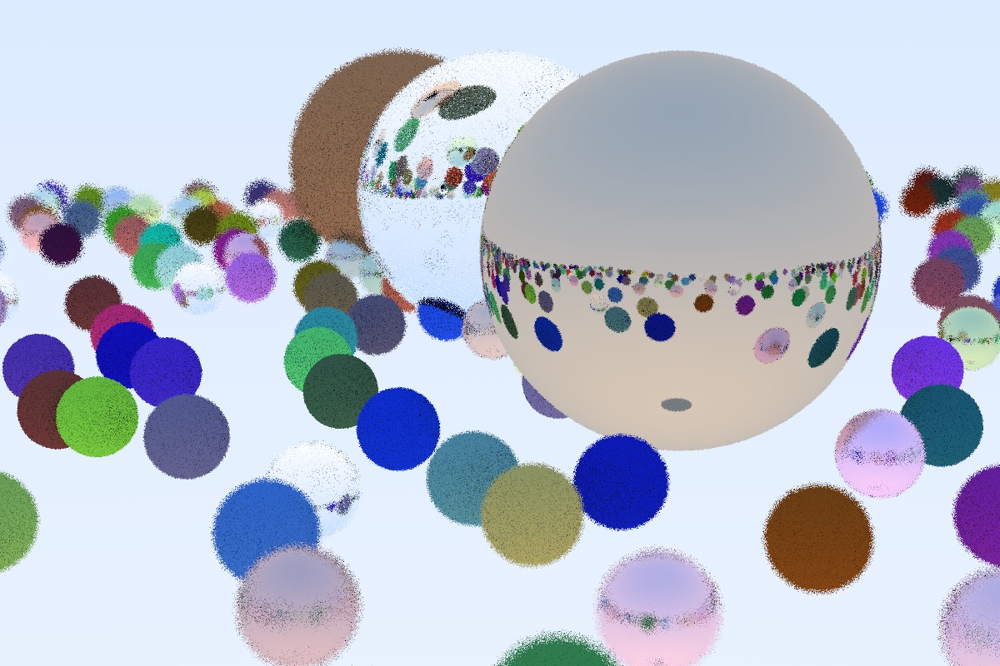

# Pyraytracer
Code to implement a raytracer using Python based on work by Peter Shirley
 **Author:** Rebecca Vandewalle
 **NetID:** rcv3
 **Date started:** April 30, 2021
 CS 418 4 Credit MP: Ray Tracing

This code can produce an output image that looks like this one!

## How to run the code
Code for the final render is stored in [render\_final_image.py](render_final_image.py).
Simply run the file using the command: `python render_final_image.py` (using the approperate command to run a Python3 script). No command line arguments are needed. This script outputs a raytracer image in ppm file format called `output.ppm`.
## What is included
This code implements a Python raytracer based on C++ raytracer code by Peter Shirley in [Ray Tracing in One Weekend](https://raytracing.github.io/books/RayTracingInOneWeekend.html) and [Ray Tracing: The Next Week](https://raytracing.github.io/books/RayTracingTheNextWeek.html). All of the code from Ray Tracing in One Weekend is implemented, and selected portions of Ray Tracing: The Next Week is included.
## Code structure
Source code is stored in modules within the `\src\raytracer` directory. Some unit tests can be found in the `\test` directory. The code base was developed in a series of Jupyter Notebooks. These Notebooks can be found in the `\rweekend` and `\rnextweek` folders.
## Example renders
Test PPM images (and a few JPEGs) of different stages of the render development can be found in the `\example_renders\rweekend` and `\example_renders]rnextweek` folders.
## Dependencies
This code uses Python 3. The only external library used is [Pillow](https://pillow.readthedocs.io/), which is only used to process inage data for texture mapping. If you want to run the provided unit tests (note: not full coverage), you will need [pytest](https://docs.pytest.org/en/6.2.x/) and optionally [pytest-cov](https://pytest-cov.readthedocs.io/en/latest/).
