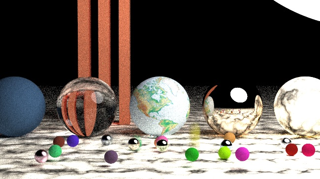
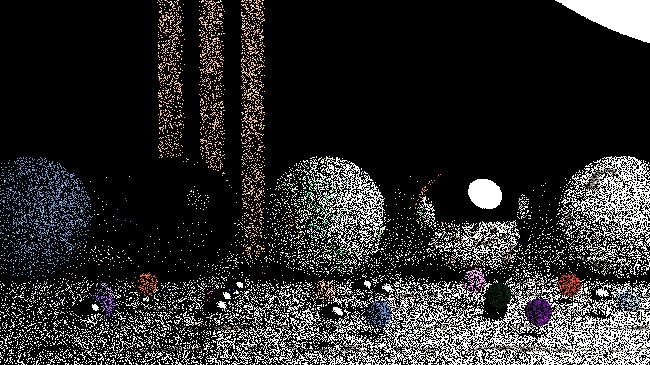
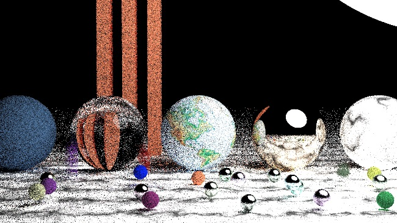
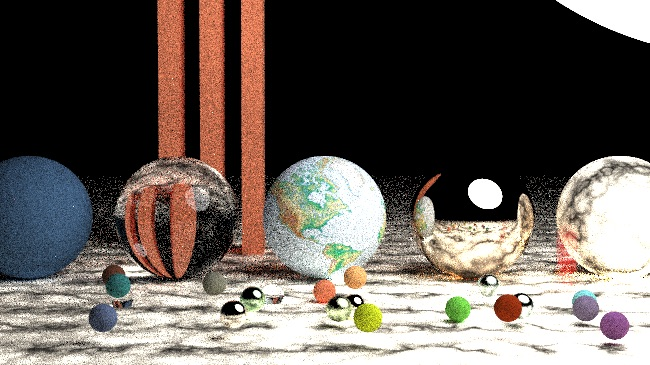
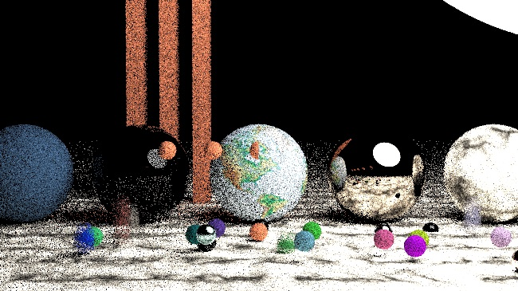

# Pyraytracer
Code to implement a raytracer using Python based on work by Peter Shirley
 **Author:** Rebecca Vandewalle
 **NetID / email:** rcv3, rcv3@illinois.edu
 **Date started:** April 30, 2021
 **Last updated:** May 7, 2021
 CS 418 4 Credit MP: Ray Tracing

This code can produce an output image that looks like this one (in 31 hours)!

## How to run the code
Code for the final render is stored in [render\_final_image.py](render_final_image.py).
Simply run the file using the command: `python render_final_image.py` (using the appropriate command to run a Python3 script). No command line arguments are needed. This script outputs a raytracer image in ppm file format called `output.ppm`.
 When you run `python render_final_image.py` it will first print the starting time, then a countdown of how many rows are left to compute, then the ending and elapsed time.
  
**WARNING!!!**
 This code may take a while to render, especially if set with a large number of samples per pixel!! For a quick check, `python render_final_image.py` is currently set to 3 samples per pixel value and 3 max depth (see below) and will render an image in approximately 16 minutes to render. The final image shown above took ~31 hours to render. 
## What is included
This code implements a Python raytracer based on C++ raytracer code by Peter Shirley in [Ray Tracing in One Weekend](https://raytracing.github.io/books/RayTracingInOneWeekend.html) and [Ray Tracing: The Next Week](https://raytracing.github.io/books/RayTracingTheNextWeek.html). All of the code from Ray Tracing in One Weekend is implemented, and selected portions of Ray Tracing: The Next Week is included.
## Code structure
Source code is stored in modules within the `\src\raytracer` directory. Some unit tests can be found in the `\test` directory. The code base was developed in a series of Jupyter Notebooks. These Notebooks can be found in the `\rweekend` and `\rnextweek` folders.
## Example renders
Test PPM images (and a few JPEGs) of different stages of the render development can be found in the `\example_renders\rweekend` and `\example_renders]rnextweek` folders.
## Dependencies
This code uses Python 3. The only external library used is [Pillow](https://pillow.readthedocs.io/), which is only used to process image data for texture mapping. If you want to run the provided unit tests (note: not full coverage), you will need [pytest](https://docs.pytest.org/en/6.2.x/) and optionally [pytest-cov](https://pytest-cov.readthedocs.io/en/latest/).
## Image Quality and Render Time
Two parameters primarily determine both image quality and render time. Samples per pixel, which determines how smooth the final image looks, and max depth, which determines recursion in the case of reflective materials such as glass. The following images show the same scene, with different samples per pixel for comparison. Render time is machine dependent. Images have been converted from ppm to jpg to display with markdown.
  This image is run with 3 samples per pixel and 3 max depth. It takes 16 minutes to run on my machine.
 
 This image renders fairly fast. This image and the following have a max depth of 30.
 
 This image takes about 10 hours to render.
 
 This last image took about 31 hours for me to render.
 
 This is the image with the bounding box hierarchy implemented.
 
## Features Implemented
References are to selected example lines in `python render_final_image.py`
 1. Positionable camera (line 276)
 2. Spheres (line 154)
 3. Diffuse material (line 136)
 4. Metal material (line 144)
 5. Dielectric material (line 143)
 6. Instances (line 149)
 7. Bounding Volume Hierarchy (line 208 in `render_final_image_bvh.py` example final image in `final_outfile_bvh.ppm` - the code is implemented in `\src\raytracer\hittables` but I forgot to add it directly into the higher resolution final image)
 8. Plane (line 204)
 9. Shadows (from light sphere at lines 206-207)
 10. Creativity (perlin texture and image texture lines 141-142)

